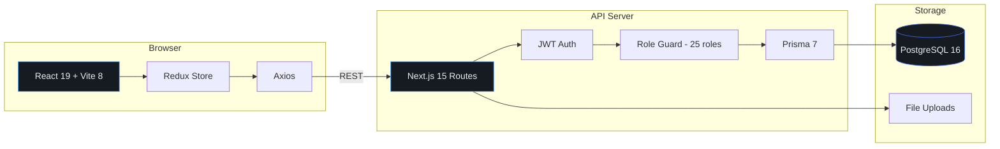

<p align="center">
  
</p>

<p align="center">
  
  
  
  
  
  
  
</p>

---

Full-stack ERP for small-to-mid teams. HR, payroll, hiring pipelines, project management, CRM, invoicing, time tracking, content review, team chat, and a 25-role permission system -- one app instead of fifteen SaaS subscriptions.

<p align="center">
  
</p>

## Features

| Module | What it does |
|--------|-------------|
| **HR & Payroll** | Salary processing, attendance, leave management, employee documents, behavioral scoring |
| **HireFlow** | Job postings, 12-stage candidate pipeline, resume review, interview scheduling, ratings |
| **Projects & Tasks** | Kanban boards, task dependencies, collaborators, discussion scheduling, progress tracking |
| **Time Tracking** | Start/stop timers, billable hours, per-project and per-task breakdowns |
| **Invoicing** | Generate, send, track. Client-linked. Multi-currency (INR, USD, GBP, CAD, AUD, AED) |
| **Expenses** | Submit, approve, reimburse. 10 categories. Receipt uploads |
| **CRM** | Clients, 7-stage lead pipeline, follow-ups, lead-to-task linking |
| **Content Review** | Video/script/graphic review with timestamped comments, approval workflows, revision chains |
| **Content Workspace** | Asset library, collections, Figma/Miro embeds, tagging system |
| **Password Vault** | Encrypted credential storage, granular access grants, copy/view audit logs |
| **Complaints** | File, escalate (HR -> PM -> CEO/CTO), timeline tracking, anonymous filing |
| **Chat** | DMs, group rooms, project channels, file sharing, reply threads |
| **Docs & Wiki** | Nested documents, rich text editor, project-scoped, publishable |
| **Goals & OKRs** | Company/team/personal goals, metric tracking, parent-child hierarchy |
| **Identity Verification** | Multi-country document verification (Aadhaar, PAN, Passport, SSN, Emirates ID, etc.) |
| **Email Client** | SMTP-based send, delivery tracking, invoice emails |
| **Personality Test** | Carl Jung MBTI assessment for team compatibility |
| **Admin Panel** | System config, audit logs, API key management, user administration |

## Tech Stack

<p align="center">
  
  
  
  
</p>
<p align="center">
  
  
  
  
</p>

## Quick Start

### Docker (recommended)

```bash
git clone https://github.com/darshjme/knowai-erp.git && cd knowai-erp
docker compose up -d
```

Frontend at `localhost:5173`, API at `localhost:3001`.

### Manual

```bash
# 1. Start PostgreSQL
docker compose up postgres -d

# 2. Backend
cd backend && npm install && npx prisma db push && npm run dev

# 3. Frontend (new terminal)
cd frontend && npm install && npm run dev
```

## Architecture



## Role Hierarchy

<details>
<summary>25 roles across 8 tiers</summary>

<br/>

| Tier | Roles |
|------|-------|
| **C-Suite** | CEO, CTO, CFO, Brand Face |
| **Management** | Admin, HR, Product Owner, Brand Partner |
| **Accounting** | Sr. Accountant, Jr. Accountant |
| **Development** | Sr. Developer, Jr. Developer |
| **Design** | Sr. Graphic Designer, Jr. Graphic Designer |
| **Content & Editorial** | Sr. Editor, Jr. Editor, Sr. Content Strategist, Jr. Content Strategist |
| **Script & Brand** | Sr. Script Writer, Jr. Script Writer, Sr. Brand Strategist, Jr. Brand Strategist |
| **Operations** | Driver, Team Member, Office Assistant |

CEO, CTO, and Admin get unrestricted access. Everyone else gets scoped sidebar items, dashboard widgets, and data visibility. Senior roles see team-level data. Juniors see their own.

</details>

## API Overview

<details>
<summary>63 route handlers across 8 domains</summary>

<br/>

**Auth**
`/api/auth/login` | `/api/auth/signup` | `/api/auth/two-factor` | `/api/auth/change-password` | `/api/auth/forgot-password`

**Projects & Tasks**
`/api/projects` | `/api/tasks` | `/api/calendar` | `/api/time-tracking` | `/api/goals` | `/api/spaces` | `/api/canvas` | `/api/docs`

**HR & People**
`/api/hr` | `/api/hr/employee-analytics` | `/api/hr/password-management` | `/api/payroll` | `/api/leaves` | `/api/hiring` | `/api/careers` | `/api/documents` | `/api/document-verification` | `/api/complaints` | `/api/onboarding` | `/api/personality-test`

**Finance**
`/api/invoices` | `/api/expenses` | `/api/subscriptions`

**CRM**
`/api/clients` | `/api/leads` | `/api/contacts`

**Content**
`/api/video-reviews` | `/api/content-workspace` | `/api/files` | `/api/sops`

**Communication**
`/api/chat` | `/api/chatbot` | `/api/email` | `/api/email-dashboard` | `/api/notifications`

**Platform**
`/api/dashboard` | `/api/analytics` | `/api/reports` | `/api/audit` | `/api/admin` | `/api/admin/config` | `/api/admin/stats` | `/api/settings` | `/api/settings/preferences` | `/api/credentials` | `/api/api-keys` | `/api/webhooks` | `/api/favorites` | `/api/requests` | `/api/change-requests` | `/api/accountability` | `/api/profile-setup` | `/api/team`

All endpoints require `Bearer <JWT>` auth. Role guards enforce access at the middleware layer.

</details>

## Contributing

Fork it, branch it, PR it. Run `npm run lint` before pushing.

## License

ISC

---

<p align="center">
  <a href="https://darshj.me">darshj.me</a>
</p>
